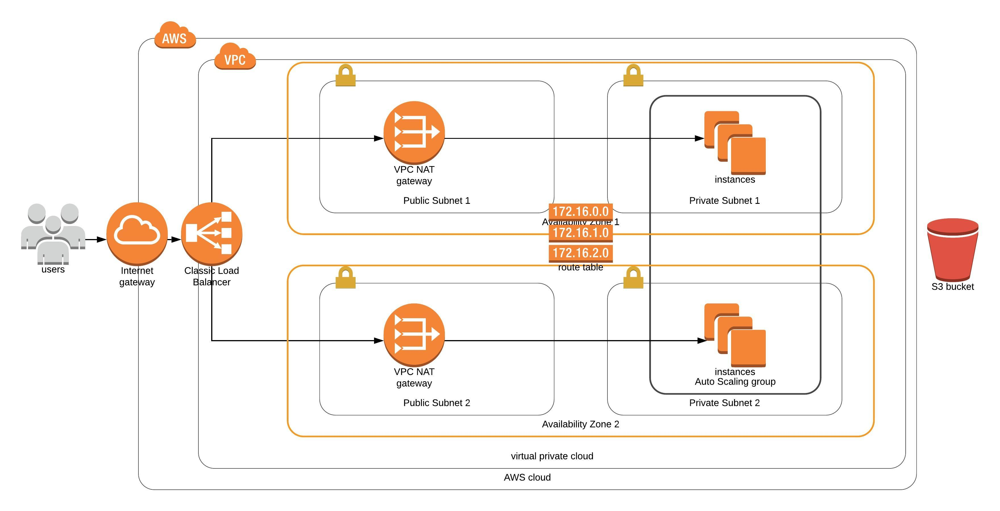

# Udacity Cloud Devops Engineer Nanodegree - Project Deploy a high-availability web app using CloudFormation 

This is an Project for the [Udacity Devops Engineer Nanodegree](https://eu.udacity.com/course/cloud-dev-ops-nanodegree--nd9991) program.

The task was to deploy a high availability website Udagram. The website source code is hosted on a public s3 bucket. Udagram should be hosted on ec2 servers within
private subnets and all trafic to the servers should be routed through NAT gateways located in public subnets.

To deploy this infrastructure execute `./create.sh --stackname server.yml params.json`

This is the infrastructure diagram for what this cloudformation script deploys:

